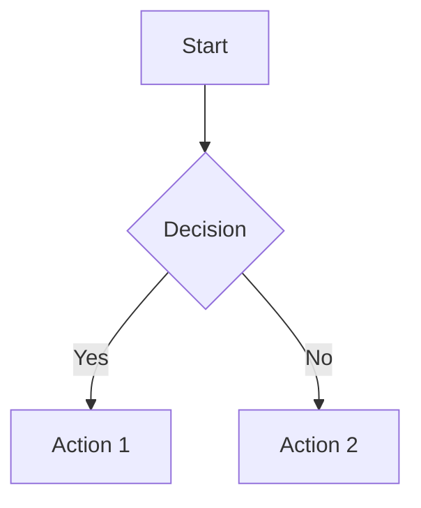
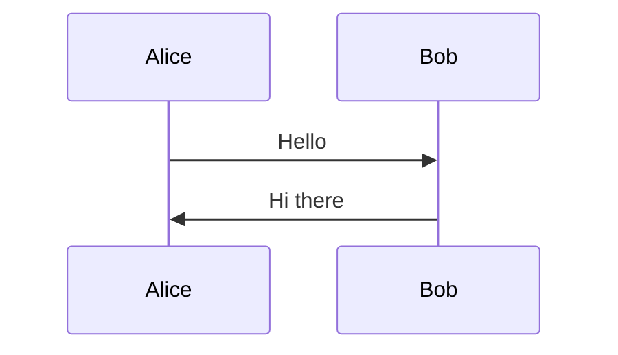

:# Smoke Test — mermaid-render skill

## Test 1 — Render simple flowchart

Create `/tmp/smoke-flow.mmd`:



Run:

```bash
cd /home/openclaw/.openclaw/workspace/skills/mermaid-render && \
uv run python bin/render-diagram.py \
  --mmd /tmp/smoke-flow.mmd \
  --outdir /tmp/mermaid-smoke \
  --slug smoke-flow
```

**Expected:**
- JSON with `success: true`
- 4 files exist: `.mmd`, `.svg`, `.png`, `.excalidraw`
- `.png` is valid PNG (non-zero size)
- `.svg` contains `<svg` tag
- `.excalidraw` is valid JSON

## Test 2 — Render sequence diagram

Create `/tmp/smoke-seq.mmd`:



Run:

```bash
cd /home/openclaw/.openclaw/workspace/skills/mermaid-render && \
uv run python bin/render-diagram.py \
  --mmd /tmp/smoke-seq.mmd \
  --outdir /tmp/mermaid-smoke \
  --slug smoke-seq
```

**Expected:**
- `success: true`
- `.mmd`, `.svg`, `.png` exist
- `.excalidraw` is null (sequence diagrams not flowcharts)

## Test 3 — Missing bundle

Rename `lib/diagram-render.html` temporarily and run Test 1.

**Expected:** `error: "diagram-render.html bundle missing"`, `exit_code: 2`

## Test 4 — Invalid mmd path

Run with `--mmd /tmp/does-not-exist.mmd`.

**Expected:** `error: "mmd file not found..."`, `exit_code`: 3

## Pass criteria

Tests 1-2 must pass. Tests 3-4 must produce correct error codes.

## Cleanup

```bash
rm -rf /tmp/mermaid-smoke /tmp/smoke-flow.mmd /tmp/smoke-seq.mmd
```